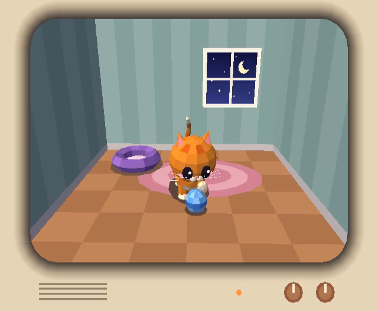
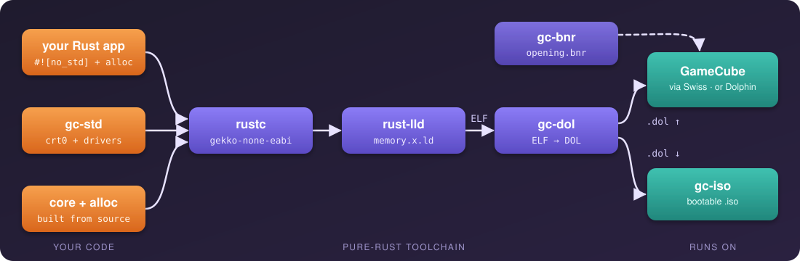

<div align="center">

# 🦀 gc-rust 🎮

### GameCube homebrew in 100% pure Rust — no devkitPro, no libogc, no C toolchain.

[](https://rustup.rs)
[](powerpc-gekko-none-eabi.json)
[](#-is-it-really-pure-rust)
[](#-on-a-real-gamecube)
[](#-license)



*Meet **yarn-cat** — a low-poly kitten who lives inside your TV and will not
stop batting that ball of yarn. GX-rendered, spring-animated, written in Rust,
running on a real GameCube.*

**⭐ If this made you smile, please [star the repo](https://github.com/portlandhodl/gc-rust) — it helps other
homebrew folks find it!**

</div>

---

`rustc` compiles your code for the GameCube's Gekko CPU (a big-endian
PowerPC 750CXe), `rust-lld` links it against a memory map we ship, and a
tiny pure-Rust tool packs it into a bootable `.dol`. That's the whole
toolchain.

<p align="center">
  
</p>

## ⚡ Quick start

```bash
rustup toolchain install nightly --component rust-src
git clone https://github.com/portlandhodl/gc-rust && cd gc-rust
make                       # every example -> dist/*.dol (header-validated)
make sd EXAMPLE=yarn-cat   # Swiss-ready SD folder with a banner
```

That's it. No devkitPro, no gcc, no libogc, no elf2dol.

## 🎮 On a real GameCube

1. `make sd EXAMPLE=yarn-cat`
2. Copy `dist/sd/yarn-cat/` onto your SD card (SD2SP2, SD Gecko, …).
3. Boot **Swiss** — the folder shows up as one entry with its own banner,
   title and description (built by `tools/gc-bnr`).

Any other `dist/*.dol` works too: drop it on the card and load it from Swiss
(or any GC homebrew loader). `make iso EXAMPLE=dvd-read` even builds a
bootable GCM disc image with our own Rust apploader.

> 💡 **Hardware honesty:** Dolphin is wonderfully forgiving — cache
> coherency, the GX fixed-point rasterizer's range, the `zcomploc`
> copy-clear quirk, alignment exceptions… `gc-rust` has been fixed against
> all of those *on real hardware*, and `gx-diag` / `gx-selftest` exist so
> you can check a console in one photo.

## 🧰 What's in the box

| | |
|---|---|
| 🧠 **Rust for real** | `core` + `alloc` via `-Zbuild-std` — `Vec`, `String`, `Box`, `format!`, `BTreeMap` all work on the console |
| 🚀 **Bring-up** | `crt0.rs`: real-mode BATs, caches, FPU + paired singles, stack, BSS — then `main()` |
| 🖼️ **GX 3D** | command FIFO, immediate-mode vertices, matrices, TEV, depth, culling, EFB→XFB copy, EFB peeks |
| 📺 **Video** | NTSC / PAL / MPAL / EURGB60, 480i + 480p, YUY2 XFB, double-buffered flip chain |
| 🔊 **Audio** | 32-voice DSP mixer (`aesnd`) through ARAM, plus a simple 48 kHz PCM path; DSP-ADPCM decode |
| 🕹️ **Input** | buttons, sticks, triggers, origin calibration, hot-plug |
| 🧵 **Threads** | preemptive LWP threads, mutexes, channels, wait-queues |
| 💾 **Storage** | memory cards (`CARD_*` filesystem), SD/SDHC over SPI + FAT16/32, DVD drive reads |
| 🌐 **Network** | BBA Ethernet + a tiny IP stack (ARP, ICMP ping, UDP) |
| 🛠️ **Tools** | `gc-dol` (ELF→DOL), `gc-iso` (bootable GCM), `gc-bnr` (Swiss/IPL banners) — all Rust |
| 🧮 **Extras** | `gu` matrix math, text console (`println!`), interrupts, a byte-exact heap |

## 🐾 Examples

`make <name>` builds one; `make run EXAMPLE=<name>` opens it in Dolphin.

| # | name | what it shows |
|---|------|---------------|
| 01 | `hello-console` | Text console, `println!`, button polling |
| 02 | `pad-input` | Buttons, held state, analog sticks, triggers |
| 03 | `heap-strings` | `Vec`, `String`, `BTreeMap`, `Box`, `format!` |
| 04 | `video-info` | The detected video mode |
| 05 | `pixel-plasma` | Software-rendered plasma straight into the YUY2 framebuffer |
| 06 | `gx-clear` | GX bring-up, pulsing clear colour |
| 07 | `gx-triangle` | Immediate-mode rainbow triangle |
| 08 | `gx-cube` | Depth-tested spinning cube |
| 09 | `gx-textured-cube` | Procedural RGB565 texture, 4×4 tile swizzle |
| 10 | `gx-lit-cube` | Per-vertex lighting |
| 11 | `irq-timer` | VI retrace through the PI interrupt handler |
| 12 | `pad-calibrated` | Origin calibration + hot-plug |
| 13 | `audio-beep` | 48 kHz PCM via AI DMA |
| 14 | `dsp-mixer` | Polyphonic chords mixed on the DSP |
| 15 | `exi-sram` | EXI bus + system SRAM settings |
| 16 | `memcard` | Save files on a real memory card |
| 17 | `usb-gecko` | USB Gecko debug output |
| 18 | `sd-file` | SD Gecko: FAT32 mount, list, read |
| 19 | `dvd-read` | DVD drive reads; boots as a full ISO (`make iso`) |
| 20 | `threads` | Preemptive background agent thread |
| 21 | `thread-sync` | Channels, mutexes, wait-queues |
| 22 | `net-echo` | BBA Ethernet: ARP + ICMP ping |
| 23 | **`yarn-cat`** 🐱 | **The kitten.** Flat-shaded GX room, chase / crouch / wiggle / swat AI, a spring-driven spine (A tosses the yarn, the stick nudges it) |
| 24 | `gx-diag` | GX test card — 2D, depth test and culling in four quadrants |
| 25 | `gx-selftest` | Draws, reads the EFB back, prints PASS/FAIL on screen |

## ✍️ Write your own

Make `examples/NN-mycoolgame/` (package name `mycoolgame`) and start from:

```rust
#![no_std]
#![no_main]
use gc_std::{println, input::button};

#[no_mangle]
extern "C" fn main() -> i32 {
    let mut gc = gc_std::init();
    gc.enable_console();
    println!("Hello GameCube 👋");
    loop {
        gc_std::video::wait_vsync();
        gc_std::input::scan();
        if gc_std::input::buttons_down(0).contains(button::START) {
            gc_std::system::exit(0);
        }
    }
}
```

Then `make mycoolgame`. For 3D, start from `08-gx-cube` or `23-yarn-cat`.
Want ideas? **[AGENTS.md](AGENTS.md)** has a list of things to build and
ways to contribute — for humans and coding agents alike.

## 🧪 Testing

```bash
make check   # gc-dol + gc-bnr unit tests, host tests (matrix math, heap,
             # emulated memory card + SD/FAT32), and a headless Dolphin
             # boot of every dist/*.dol
```

The Dolphin smoke tests use a source build of Dolphin (nogui) at
`~/git/dolphin/build-x86_64-release/Binaries/dolphin-emu-nogui` (override
with `DOLPHIN_NOGUI=...`); they're skipped when it's absent:

```bash
cmake -G Ninja -B build-x86_64-release \
  -DENABLE_QT=OFF -DENABLE_NOGUI=ON -DENABLE_TESTS=OFF \
  -DENABLE_VULKAN=OFF -DENABLE_LLVM=OFF
ninja -C build-x86_64-release dolphin-emu-nogui
ln -s ../../Data/Sys build-x86_64-release/Binaries/Sys   # uninstalled build needs its data
```

## 🔍 How it works

| piece | notes |
|-------|-------|
| `powerpc-gekko-none-eabi.json` | custom rustc target: big-endian, +FPU (`750`), static relocs, panic=abort, `rust-lld` |
| `memory.x.ld` | MEM1 layout: entry at `0x80003100`, framebuffers + stack at the top of 24 MiB |
| `crates/gc-std/src/crt0.rs` | `_start`: real-mode BAT/HID0/L2/FPSCR setup, back to virtual mode, clear `.bss`, call `main()` |
| `crates/gc-std/src/hw.rs` | MMIO + write-gather pipe helpers, cache ops, timebase |
| `crates/gc-std/src/video.rs` | VI timings (NTSC/PAL/MPAL/EURGB60 + 480p), framebuffers, vsync, flip chain |
| `crates/gc-std/src/gx.rs` | GX register shadows, BP/CP/XF writers, command FIFO, pipeline + diagnostics |
| `crates/gc-std/src/gu.rs` | matrix math in pure Rust (Cephes-style scalar libm included) |
| `crates/gc-std/src/irq.rs` | PI interrupt controller, exception trampolines, per-source handlers |
| `crates/gc-std/src/input.rs` | SI polling with origin calibration + hot-plug |
| `crates/gc-std/src/aesnd.rs` | DSP-mixer voices: parameter blocks, `0xface*` mail protocol (libaesnd port) |
| `crates/gc-std/src/dvd.rs` | DI drive: disc ID, inquiry, raw reads (libogc `DVD_Low*` port) |
| `crates/gc-std/src/lwp.rs` | threads: decrementer preemption, full CPU context per thread |
| `tools/gc-dol` · `tools/gc-iso` · `tools/gc-bnr` | ELF→DOL packer, bootable GCM builder (+ Rust apploader), banner builder |

### 🦀 Is it really pure Rust?

Yes — no `.c`/`.cpp`/`.S` files, no `build.rs`, no `cc`/`bindgen`, every
crate in `Cargo.lock` is ours, and `core`/`alloc`/`compiler_builtins` are
built from Rust source. A few unavoidable spots use PowerPC instructions via
Rust's `asm!` (boot, exception entry, cache ops, special registers), exactly
where any GameCube library needs assembly. Much of `gc-std` is a careful Rust
port of libogc's *logic* (hardware quirks included), and `dspcode.rs` embeds
the audio DSP's microcode as bytes.

## 🤝 Contributing

New drivers, examples, bug reports from real consoles, docs — all welcome!
See **[AGENTS.md](AGENTS.md)** for ideas, the conventions, and the checklist
(run `make check`, and test GX changes on hardware when you can).

## 📜 License

MIT OR Apache-2.0 (see `LICENSE-MIT` / `LICENSE-APACHE`).

Hardware register semantics and bit encodings follow libogc and Dolphin's
source. No libogc code or binaries are linked.

<div align="center">

**Made with 🦀 and 🧶 — if you enjoyed it, a ⭐ on [GitHub](https://github.com/portlandhodl/gc-rust) means a lot!**

</div>
